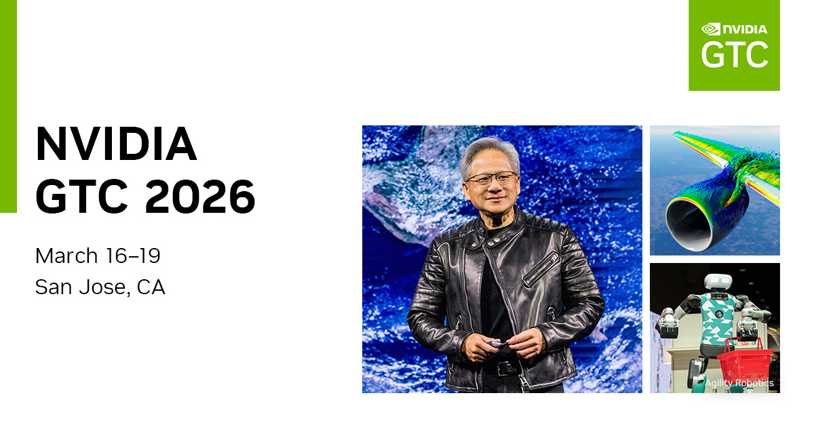
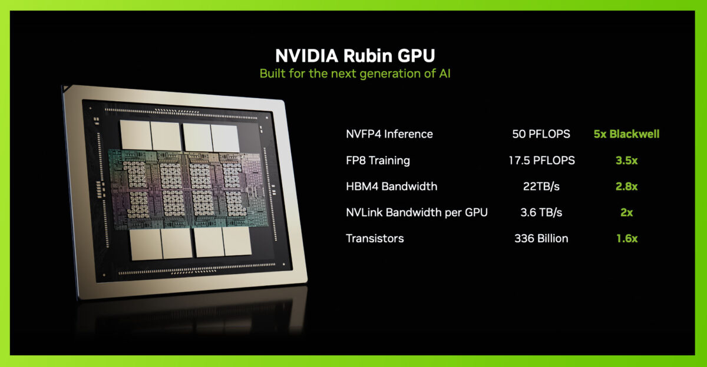
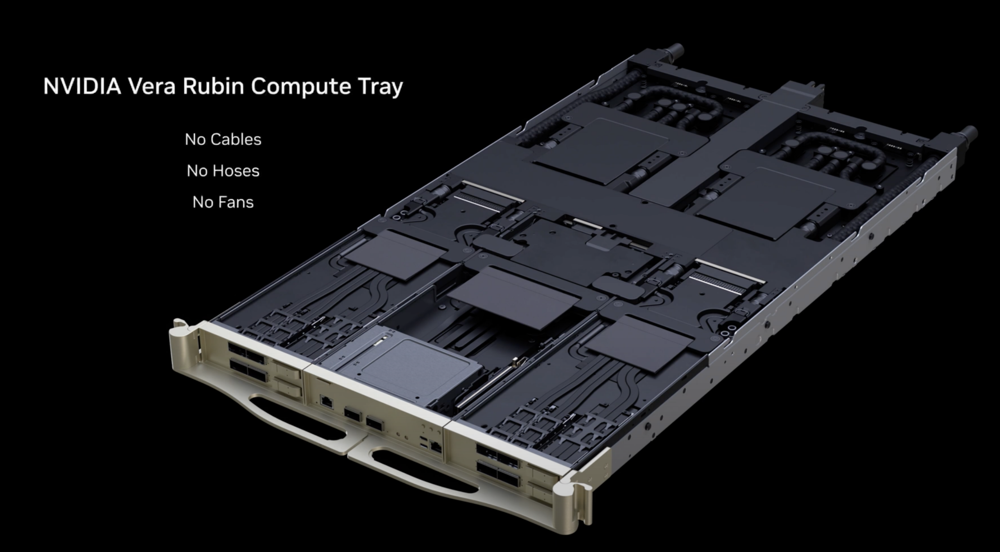

2026年3月16日上午11点，圣何塞SAP中心座无虚席。来自全球190个国家的超过3万名参会者屏息以待，等待一个穿着标志性皮衣的男人走上舞台。当黄仁勋（Jensen Huang）在掌声雷动中亮相，开启长达两小时的GTC 2026主题演讲时，整个AI产业都在注视——因为这一次，英伟达不只是发布了新芯片，而是展示了一整套**重新定义AI基础设施**的宏大蓝图。

从3360亿晶体管的Rubin GPU到全球首个千兆瓦级AI合作伙伴关系，从开源智能体平台NemoClaw到与礼来制药共建的世界最强药物研发AI工厂，GTC 2026的信息密度让人窒息。黄仁勋在演讲中直言："AI是人类历史上最强大的知识发现工具。每家公司都将使用它，每个国家都将建设它。"这不是预测，而是宣言。

## 十座场馆、三万人：GTC已成AI产业的"超级碗"

GTC 2026的规模史无前例。大会于3月16日至19日在加州圣何塞市中心举办，**横跨十个场馆**，涵盖SAP中心、圣何塞会议中心和市政中心等标志性建筑。700余场技术演讲、70多个动手实验室、150篇研究海报，加上400家参展商——这已经不再是一个技术开发者大会，而更像是一场科技产业的年度盛典。《财富》杂志称其为"AI界的伍德斯托克音乐节"，The Register则将其比作"AI版火人节"。

大会门票早已售罄，仅剩展览参观通行证可供购买。在主题演讲前三小时，一场由硅谷顶级投资人莎拉·郭（Conviction创始人）、加文·贝克（Atreides管理公司）和阿尔弗雷德·林（红杉资本）联合主持的"赛前秀"率先暖场，Perplexity CEO阿拉温德·斯里尼瓦斯、Mistral AI CEO阿瑟·门奇、戴尔CEO迈克尔·戴尔、Palantir总裁阿基·贾因等科技界重量级人物悉数登场，预告了大会的核心议题。

## Vera Rubin：3360亿晶体管缔造的算力怪兽

如果说GTC 2026只有一个主角，那就是**Vera Rubin**——英伟达下一代AI计算平台。这个以诺贝尔物理学奖得主薇拉·鲁宾命名的平台，在今年1月CES上首次亮相并进入全面量产，此次GTC则是其首次面向全球开发者和企业客户的深度技术展示。

Rubin GPU采用台积电3nm工艺制造，集成**3360亿个晶体管**，较上一代Blackwell的2080亿增加了61.5%。每颗GPU配备288GB HBM4显存，显存带宽达到惊人的**22TB/s**——几乎是Blackwell HBM3e的三倍。推理性能达到**50 PFLOPS（NVFP4）**，训练性能35 PFLOPS，分别是Blackwell的5倍和3.5倍。第三代Transformer引擎带来了硬件级自适应压缩加速，让大模型训练和推理效率实现质的飞跃。

与Rubin GPU搭档的是全新的Vera CPU，代号"奥林匹斯"（Olympus）。这颗88核心的Arm v9.2-A处理器引入了英伟达独创的"空间多线程"（Spatial Multi-Threading）技术——每个线程都能获得完整的核心算力，等效于176核心的处理能力。配备最高1.5TB LPDDR5X内存和1.2TB/s带宽，数据处理和压缩性能是上一代Grace CPU的两倍。值得注意的是，英伟达首次将Vera作为独立CPU产品推向市场，直接挑战Intel和AMD在服务器CPU领域的统治地位。据报道，**Meta已在评估将Vera CPU用于其数据中心**。

## NVL72机架：把整个互联网的带宽装进一个机柜

真正让人倒吸一口冷气的，是Vera Rubin NVL72整机柜系统。这个单一机架集成了**72颗Rubin GPU、36颗Vera CPU和18颗BlueField-4 DPU**，全机架拥有220万亿个晶体管。推理算力达到**3.6 EFLOPS（ExaFLOPS）**，训练算力2.5 EFLOPS。机架内部总HBM4显存为20.7TB，LPDDR5X内存54TB。

NVLink 6互连技术为每颗GPU提供3.6TB/s的全对全带宽，整个机架的聚合NVLink带宽达到**260TB/s**——黄仁勋在演讲中指出，这超过了全球互联网的横截面带宽总和的两倍。

但最令工程师们兴奋的或许是设计哲学上的革命：NVL72采用100%液冷设计，**无风扇、无管道、无线缆**，模块化托盘可在不停机的情况下更换维护。安装时间从Blackwell时代的约100分钟骤降至**仅需5-6分钟**。推理成本仅为Blackwell的十分之一，训练同等规模的混合专家模型（MoE）所需GPU数量减少75%。

首批部署合作伙伴包括AWS、Google Cloud、微软Azure、Oracle Cloud、CoreWeave和Lambda，预计2026年下半年开始量产交付。

## 从Blackwell Ultra到Feynman：四代产品同台的"芯片交响曲"

GTC 2026展示了英伟达前所未有的产品纵深。除了核心的Vera Rubin平台，还有多条产品线同步推进。

**Blackwell Ultra（B300系列）**作为过渡产品持续服务现有客户。B300升级至HBM4显存，GPT-4级模型训练吞吐量提升35%，推理每秒Token数提升45-50%。DGX B300系统售价约30万美元，单颗B300 GPU定价预计在4-5万美元。对于尚未准备好全面迁移至Vera Rubin的企业，Blackwell Ultra提供了一条务实的升级路径。

远期路线图同样令人瞩目。**Rubin Ultra**确认将于2027年推出，晶体管数量突破5000亿大关，配备384GB HBM4E显存和32TB/s带宽，采用NVL576配置（576颗GPU组成的超级集群），单机架功耗高达600kW，性能将是Grace Blackwell的14.4倍。

更远的**Feynman架构**（2028年）则是英伟达首个"推理优先"设计的GPU架构，采用台积电A16（1.6nm）工艺——量产阶段最先进的制程。最具颠覆性的是，Feynman将率先引入**硅光子（Silicon Photonics）**互连技术，从根本上解决传统电互连的数据瓶颈。黄仁勋在演讲前曾暗示将展示"世界从未见过的芯片"，分析师普遍认为这指向Feynman架构的首次公开亮相。

## Groq的LPU来了：推理市场迎来"GPU+LPU"双引擎时代

2025年底英伟达以约200亿美元获得Groq技术授权的交易，在GTC 2026上终于揭开了产品化面纱。全新的**LPX推理机架**集成了256颗LPU（语言处理单元），较第一代增加4倍，采用52层M9 Q-glass PCB基板。

LPU基于SRAM架构，采用VLIW确定性执行模式，片上带宽高达约80TB/s，专门针对超低延迟的单批次推理和实时控制场景优化。英伟达的战略构想清晰可见：**GPU负责训练和计算密集型任务，CPX处理百万级Token的预填充计算，LPU专攻Token生成的解码阶段**——三种芯片各司其职，通过"NVLink Fusion"技术互联协作。

前Groq CEO乔纳森·罗斯（现已加入英伟达）在GTC上主持了"GPU ♥ LPU"专题演讲，系统阐述了这一混合推理架构的技术原理。这标志着AI芯片产业从"一颗GPU解决一切"走向**专用化、异构化的新范式**。

## NemoClaw与智能体革命：英伟达的软件野心

硬件之外，英伟达在GTC 2026上释放了强烈的软件平台信号。**NemoClaw**是本次大会最重要的软件发布——一个开源的企业级AI智能体（Agent）平台，让企业能够部署可自主推理、规划和执行多步骤任务的AI系统。

NemoClaw整合了三大现有组件：NeMo框架（模型训练与智能体推理）、Nemotron模型家族和NIM推理微服务。最令业界意外的是，NemoClaw被设计为**硬件无关**——不仅能在英伟达芯片上运行，也支持AMD和Intel的处理器。这打破了英伟达传统的CUDA生态锁定策略，转而效仿Meta开源Llama的打法：用开源软件构建生态依赖，同时刺激底层基础设施需求。据报道，Salesforce、Cisco、Google、Adobe和CrowdStrike已经在早期接触中。

同期发布的**Nemotron 3 Super**模型进一步夯实了智能体基座。这个1200亿参数（120亿活跃参数）的模型采用Mamba-Transformer混合专家架构，支持**100万Token上下文窗口**，智能体AI吞吐量提升5倍。在PinchBench智能体评估基准上得分85.6%，超越了Opus 4.5和GPT-OSS 120b。

GTC现场还举办了热闹的"Build-a-Claw"活动，参会者可以使用OpenClaw开源框架在DGX Spark个人AI工作站或GeForce RTX笔记本上定制和部署自己的始终在线AI智能体——管理日历、推荐行程、编写代码，一切本地运行，无需依赖云服务。

## 千兆瓦级合作：Mira Murati的Thinking Machines成最大赢家

GTC 2026周最引人注目的合作伙伴公告，当属英伟达与**Thinking Machines Lab**的战略合作。这家由前OpenAI CTO米拉·穆拉蒂（Mira Murati）创立的AI公司，与英伟达签署了多年期战略合作协议，将部署**至少1千兆瓦（GW）**的Vera Rubin系统用于前沿模型训练，目标是2027年初投入运营。

按黄仁勋此前的说法，1千兆瓦的AI数据中心建设成本高达500亿美元。这一合作的规模之大令人咋舌。Thinking Machines Lab成立仅一年多，就已融资超过20亿美元，投资方包括a16z、Accel、英伟达和AMD的风投部门，估值据传在120亿至500亿美元之间——尽管公司目前仅约120名员工，只有一款产品Tinker（用于训练AI模型的API）。英伟达还对其进行了"重大投资"（金额未披露）。

黄仁勋评价道："Thinking Machines汇集了世界级团队来推进AI前沿。我们非常兴奋能与他们合作，实现他们对AI未来的激动人心的愿景。"穆拉蒂则回应："英伟达的技术是整个领域的基石。这次合作将加速我们构建人们可以塑造和拥有的AI。"

另一重磅合作是与**礼来制药（Eli Lilly）**共同投资高达10亿美元，为期五年，共建AI药物研发联合创新实验室。已经落地的**LillyPod**是全球制药公司拥有的最强大AI工厂——搭载1016颗Blackwell Ultra GPU，AI算力超过9000 petaflops，仅用四个月便完成组装。从分子优化、药物发现到医学影像和科学AI智能体，这套系统将全面加速新药研发流程。

此外，英伟达还宣布了与**ABB机器人**（将物理AI带入工厂车间）、**Nebius集团**（开发下一代AI超大规模云）、**西门子**（共建工业AI操作系统）等企业的深度合作，以及与Mercedes-Benz在L4自动驾驶S级轿车上的合作进展。在通信领域，英伟达联合爱立信、诺基亚、德国电信、软银、T-Mobile等十余家运营商和设备商，宣布共建**AI原生的6G无线网络平台**。

## 华尔街的判断：38位分析师给出"强力买入"

GTC 2026前夕，英伟达股价报收约183美元，较2025年10月的历史高点207美元回落约11.5%，年初至今微跌3%。但华尔街对公司前景的信心几乎是一边倒的：在39位覆盖分析师中，**38位给出"强力买入"评级**，平均目标价273.61美元，意味着约52%的上涨空间。

Tigress Financial给出了全街最高的360美元目标价，理由是"AI数据中心基础设施的领导地位正在驱动强劲且持久的增长"。Wedbush的丹尼尔·艾夫斯将目标价从230美元上调至300美元。美银分析师维维克·阿里亚指出，英伟达目前约17倍的远期市盈率接近"历史底部"，Blackwell平台已累计贡献约5000亿美元收入。富国银行预计，英伟达可能在GTC期间将累计收入管线从5000亿美元上修至**超过6000亿美元**。

历史数据显示，GTC对英伟达股价通常有正向催化作用：GTC 2024期间上涨7.4%，GTC 2023上涨5.7%，GTC 2022上涨6.4%。但2025年因特朗普关税冲击导致大盘崩盘而未能如愿，2026年则面临伊朗局势和油价飙升带来的宏观不确定性。

英伟达2025财年第四季度营收达到创纪录的**681亿美元**（同比增长73%），其中数据中心业务占比高达91%。公司市值约4.6万亿美元，稳坐全球最有价值半导体公司宝座。下一季度收入指引约780亿美元，大幅超出分析师726亿美元的一致预期。

## 暗涌与挑战：在质疑声中加速前行

盛况之下并非没有隐忧。部分分析师警告，英伟达三年内1100%的股价涨幅"几乎不容许任何失误"。Google、Amazon和Meta都在加速开发自研推理芯片，The Register预计英伟达在训练和推理市场超过90%的份额"从2027年起可能面临侵蚀"。

能源消耗同样引发争议。Vera Rubin NVL72单机架功耗超过200kW，Rubin Ultra的NVL576集群更是高达600kW。当AI工厂的规模以千兆瓦计量时，公众对能源密集型数据中心的担忧与日俱增。供应链方面，台积电先进封装（CoWoS）产能持续紧张，CPU交付周期延长至6个月，价格上涨超过10%。SK海力士与三星在HBM4供应上的激烈竞争也为Rubin的量产增添了变数。

但黄仁勋显然无意放慢脚步。他在GTC期间多次驳斥"AI泡沫"的叙事，将其定性为"一场叙事战争"，警告悲观论调正在对AI投资造成实际伤害。他的五层蛋糕理论——能源、芯片、基础设施、模型、应用——每一层都在同时加速前进，意味着全球AI基础设施投资到本十年末将达到**3至4万亿美元**。

## 结语：不只是芯片发布会，而是AI工业革命的序章

GTC 2026揭示的不仅仅是几款新芯片的参数升级。从Vera Rubin到Feynman的四代产品路线图、从GPU到LPU的异构推理架构、从NemoClaw到OpenClaw的全栈智能体生态、从千兆瓦级AI工厂到6G网络的基础设施布局——英伟达正在系统性地重新定义"计算"的含义。

最深刻的变化或许是战略思维的跃迁：英伟达不再仅仅是一家芯片公司，它正在成为AI时代的**基础设施运营商**。就像电力公司不只卖发电机，而是构建从发电、输电到配电的完整网络一样，英伟达正在构建从芯片、系统、平台到模型的完整AI技术栈。

当黄仁勋说"每家公司都将使用它，每个国家都将建设它"的时候，他描述的不是一个遥远的愿景，而是一个正在加速到来的现实。GTC 2026的3万名参会者亲眼见证的，可能正是AI工业革命从概念走向大规模工业化部署的关键转折点。

而这，只是第一天。