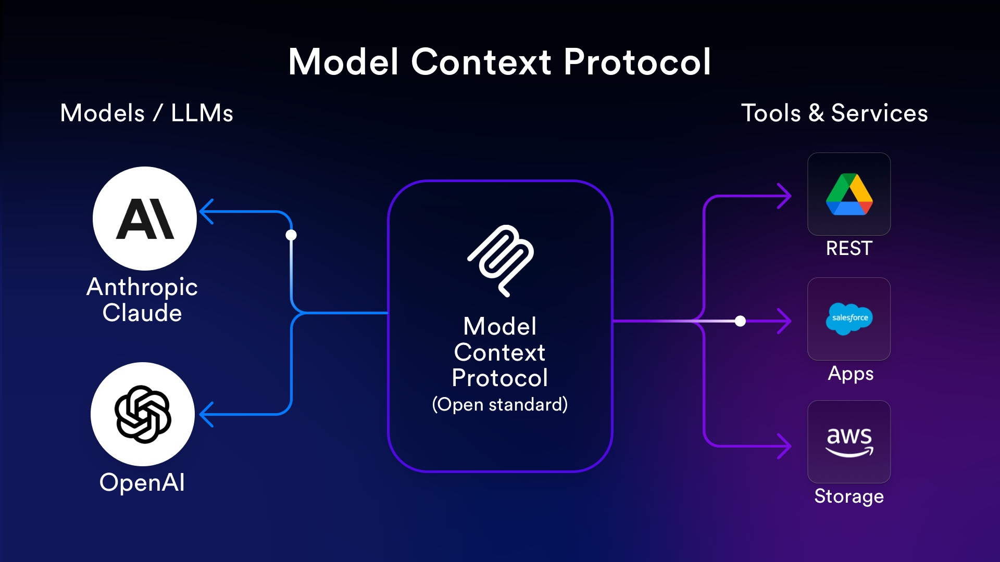

**MCP（Model Context Protocol）正经历其诞生以来最大的信任危机。** 2026年3月11日，Perplexity CTO在开发者大会上公开宣布放弃MCP，转向传统REST API；Y Combinator CEO Garry Tan同日发帖直言"MCP sucks"；安全漏洞接连爆发，上千台暴露在互联网上的MCP服务器竟零认证——这一切都在动摇着这个仅诞生一年多的"AI时代USB-C接口"的根基。然而与此同时，MCP的月SDK下载量已突破**9700万次**，OpenAI、Google、Microsoft全部入局，Linux基金会接管治理。MCP究竟是行将就木，还是正在经历每个成功标准都必经的成长阵痛？

---

## Perplexity为什么"叛变"了

2026年3月11日，Perplexity的开发者大会Ask 2026上，联合创始人兼CTO **Denis Yarats**发表了一个在AI圈引发地震的声明：Perplexity正在内部从MCP转向传统REST API和命令行工具（CLI）。值得注意的是，就在几个月前的2025年11月，Perplexity还刚刚发布了自己的官方MCP Server。

Yarats给出的理由非常务实，核心是两个字：**太贵**。

**第一，上下文窗口被疯狂吞噬。** MCP的工作原理要求把每个工具的定义、参数模式、响应格式全部塞入上下文窗口。当Agent需要调用多个工具时，这些"说明书"本身就会占据大量token。有多夸张？Apideck的实测数据显示，仅3个MCP服务器就消耗了**20万token上下文窗口中的14.3万个——占72%**——此时用户连一个字都还没说。一个完整功能的GitHub MCP服务器光初始化就要约5万token；一个拥有106个工具的数据库MCP服务器需要5.46万token。Cloudflare的分析更为惊人：如果用原生MCP方式暴露其2500个API端点，需要消耗约24.4万token，超过了大多数模型的整个上下文窗口容量。MCPGauge的研究发现，MCP集成导致输入token量膨胀**3.25倍至236.5倍**，同时平均准确率还下降了9.5%。

**第二，认证体系支离破碎。** 每个MCP服务器都需要独立处理自己的认证流程。当Agent连接多个服务时，用户面临的是一个碎片化的认证噩梦——多次登录、不同的OAuth流程、无法统一管理。安全公司Knostic扫描了约2000台暴露在互联网上的MCP服务器，手动验证的119台样本中，**认证数量为零**。

Perplexity的替代方案是其2026年2月正式上线的**Agent API**——一个单一的REST端点（`POST https://api.perplexity.ai/v1/agent`），支持GPT-5.4、Claude Opus 4.6、Gemini 3.1 Pro等6家模型提供商，内置Web搜索和URL抓取功能，只需一个API密钥。如果你已经在用OpenAI SDK，迁移代码只需改两行。

不过有一个微妙的细节：**Perplexity并没有完全砍掉MCP**。他们的官方MCP Server至今仍在文档网站上提供一键安装，支持Cursor、VS Code和Claude Desktop。"叛变"的是内部生产系统和企业级产品，面向开发者的MCP入口依然保留。

---

## 一场蓄谋已久的"反MCP运动"

Perplexity的声明并非孤立事件，而是2026年初一系列"反MCP"声浪的高潮。

**Eric Holmes**在2月28日发表了《MCP已死，CLI万岁》（"MCP is dead. Long live the CLI"），冲上Hacker News头条，文章论证CLI工具提供了更可组合、更可靠的Agent接口。**Garry Tan**（Y Combinator CEO）在Yarats宣布的同一天发帖说："MCP sucks honestly（老实说MCP烂透了）。它吃掉太多上下文窗口，你得不停开关它，认证也很烂。我受够了Chrome里通过MCP用Claude，花30分钟自己写了个Playwright的CLI封装，效果好100倍，才100行代码。" 这条帖子获得**49.2万次浏览**和1800次转发。知名独立开发者**Pieter Levels**则更直接——称MCP"没用"。

**Cloudflare**在同一天发布技术分析，展示MCP工具调用最高浪费81%的上下文窗口，并推出"Code Mode"作为替代方案，声称可减少**99.9%**的token消耗。**Scalekit**的基准测试显示，CLI方案比MCP便宜10-32倍，可靠性100%，而MCP仅为72%。

反对者的核心论点可以归纳为：**MCP解决了一个理论上优美但实践中昂贵的问题**。动态工具发现是好主意，但当每次发现的代价是吞掉大半个上下文窗口时，这个主意的性价比就值得商榷了。

当然，MCP的支持者也有力回击。他们指出，上下文窗口问题是"去年的问题"——OpenAI已经在Responses API中实现了工具搜索（工具仅在需要时加载），Anthropic测试的Code Mode可减少98.7%的token使用。还有人认为Perplexity的Agent API本质上就是"一个包装更好的MCP网关"。社区中也有声音说："MCP没有死，它只是在变成基础设施。基础设施是无聊的。没有人写关于TCP/IP的病毒式推文。"

---

## 安全噩梦：一年12起重大漏洞事件

如果说token消耗是MCP的"慢性病"，安全问题就是它的"急性发作"。从2025年4月至2026年初，MCP生态遭遇了一连串触目惊心的安全事件：

**2025年4月，WhatsApp聊天记录被窃取。** Invariant Labs发现，一个恶意MCP服务器通过"工具投毒"（tool poisoning）攻击，将一个看似无害的"每日趣闻"工具变成了后门，悄悄改写WhatsApp消息的发送逻辑，将整个聊天历史转发给攻击者控制的手机号码。

**2025年5月，GitHub私有仓库数据泄露。** 同样是Invariant Labs发现，攻击者在GitHub公开issue中嵌入恶意提示词，劫持AI助手从私有仓库拉取数据——包括内部项目细节和个人薪资信息——并泄露到公开仓库。

**2025年6月，Asana跨租户数据暴露。** Asana的MCP集成出现"困惑代理人"（Confused Deputy）漏洞，导致一个组织的数据可被其他组织看到。Asana被迫将MCP集成下线两周进行修补。同月，**Anthropic自己的MCP Inspector工具被发现存在远程代码执行漏洞**（CVE-2025-49596），攻击者可以通过让受害者检查一个恶意MCP服务器，在其开发机器上执行任意命令。

**2025年7月，mcp-remote包命令注入**（CVE-2025-6514）。这个拥有55.8万+下载量的流行OAuth代理工具被发现存在严重的命令注入漏洞，恶意MCP服务器可以发送植入恶意代码的`authorization_endpoint`直接传递给系统shell。受影响用户涉及Cloudflare、Hugging Face、Auth0的用户群。

**2025年9月，假冒Postmark MCP服务器（供应链攻击）。** 一个恶意npm包伪装成合法的Postmark邮件服务MCP Server，悄悄将所有邮件通信BCC一份给攻击者的服务器。

**2025年10月，Smithery托管平台供应链入侵。** GitGuardian发现Smithery的路径遍历漏洞泄露了构建者的Docker配置文件和Fly.io API令牌，攻击者可控制3000多个应用——即大部分托管的MCP服务器。

安全研究者Elena Cross发表了一篇标题辛辣的文章：**《MCP中的S代表安全》**——讽刺MCP缩写中根本没有S。知名开发者Simon Willison早在2025年4月就警告："提示词注入的诅咒在于，我们已经知道这个问题两年半了，仍然没有令人信服的缓解方案。"

MCPTox基准测试在45个真实MCP服务器的353个工具上测试了20个LLM Agent，发现工具投毒攻击"令人震惊地普遍"。Docker的分析显示，约**三分之二**的开源MCP服务器存在"糟糕的安全实践"，**43%**存在OAuth认证缺陷。

---

## 认证规范的"烂摊子"

安全问题的根源之一在于MCP的认证规范。Red Hat/Solo.io全球现场CTO **Christian Posta**发表了两篇在业界广为传播的批评文章：《MCP认证规范是...一团糟》和《MCP认证对企业来说是行不通的》。他指出MCP最初的OAuth实现要求MCP服务器同时充当授权服务器和资源服务器，这与企业实践完全矛盾。

**OAuth 2.1规范的联合作者Dick Hardt**直接指出，MCP的OAuth用法"与传统模式有显著不同"。另一位OAuth 2.1联合作者**Aaron Parecki**发表了《让我们修复MCP中的OAuth》，详细说明了企业SSO需求与MCP认证方式之间的冲突。

核心矛盾在于：大多数企业身份提供商（Microsoft Entra ID、Okta）不支持MCP推荐的动态客户端注册（DCR），或者明确禁用它。MCP的"匿名DCR"允许任何客户端无需身份验证就注册，这让企业的监控、审计和撤销变得极为困难。好消息是，2025年11月的新版规范引入了客户端ID元数据文档（CIMD）来替代DCR，但企业落地仍需时间。

---

## 不只是Perplexity：那些对MCP说"不"的声音

**微软AutoGen贡献者Victor Dibia**发表了《不，MCP还没有赢》，批评MCP的开发者体验差，文档过于聚焦Claude Desktop，基本示例就需要约300行代码。**Evoke Security CEO Jason Rebholz**称MCP为"即将发生的噩梦"，建议在大多数情况下都不要使用。

**LangChain CEO Harrison Chase**的态度耐人寻味：他虽然支持MCP作为标准，但坦言："如果我自己要写一个Agent来做XYZ，我百分百不会用MCP。" LangGraph负责人**Nuno Campos**更是说："在LangChain，我们拥有500个工具的库已经两年了，我几乎没见过它们在生产环境中被大量使用…我认为Zapier就是MCP潜力的天花板。"

Reddit上的开发者社区更加直言不讳：**"95%的MCP服务器都是垃圾"**——这是MCP subreddit上的原话。有人说MCP"不是解决了什么新问题，只是给AI加了一层不必要的复杂性"，还有人将其比作"SOAP到REST的历史重演"。

---

## 但MCP确实在赢：惊人的生态增长

尽管质疑声此起彼伏，MCP的生态数据却令人无法忽视。

截至2025年12月，MCP拥有**10,000+活跃公共服务器**（非官方注册表统计超过17,000个）、**300+客户端**、**9700万+月SDK下载量**。从2024年11月约10万次下载到2025年5月的800万+，6个月增长80倍。MCP规范仓库在GitHub上获得了**66,000+星标**。

更重要的是**巨头全面入局**的态势：

**OpenAI**（2025年3月）率先"投诚"，在ChatGPT Desktop、Agents SDK和Responses API中全面支持MCP。Sam Altman公开表示："人们喜爱MCP，我们很兴奋要在所有产品中添加支持。" **Google DeepMind**（2025年4月）确认Gemini模型支持MCP。**Microsoft**（2025年5月Build大会）将MCP整合进Windows 11、Azure OpenAI、Microsoft 365、VS Code、Azure Foundry，并**废弃了自己的Copilot Extensions专有方案，转向MCP**——这可能是MCP已成为事实标准的最有力证据。**AWS**将MCP融入Amazon Bedrock、Kiro IDE等15,000+个API操作。

**中国科技巨头同样在2025年4月掀起了MCP军备竞赛。** 阿里云百炼平台推出业内首个MCP全生命周期服务，集成97+工具，首周即突破1万用户；支付宝推出"支付MCP Server"实现自然语言支付；百度推出企业级MCP服务和百度地图MCP；腾讯云升级大模型知识引擎支持MCP插件；字节跳动"扣子空间"集成飞书文档和MCP支持；360推出覆盖110+企业工具的"万能工具箱"。百度CEO李彦宏公开表态："MCP让AI更好地理解外部世界、更容易获取信息、更自由地调用工具。MCP是AI发展的巨大飞跃，开发者应该尽早拥抱它。"

**Block（Square/Cash App母公司）** 在内部构建了60+个MCP服务器，用于遗留代码重构、数据库迁移、单元测试生成和合规工作流。**Bloomberg**将MCP定为全组织标准，将工具上线时间从"数天缩短到数分钟"。**Atlassian**的Rovo MCP Server中，企业客户占约50%的使用量。

---

## 规范在进化：从本地玩具到企业基础设施

MCP规范经历了快速迭代。2024年11月的初始版本仅支持本地stdio传输，是个纯粹的本地协议。2025年3月引入**Streamable HTTP传输**和OAuth 2.0，实现了从本地到远程的关键跨越。2025年6月版本正式将MCP服务器定义为OAuth资源服务器。

**2025年11月的一周年版本**是迄今最大升级，带来了：异步任务原语（Tasks）实现"发起调用、稍后获取结果"的模式；客户端ID元数据文档（CIMD）替代问题重重的动态客户端注册；跨应用访问扩展支持企业SSO；正式的扩展框架机制；以及机器对机器的OAuth client-credentials支持。

**2025年12月9日，Anthropic将MCP捐赠给Linux基金会旗下新成立的Agentic AI Foundation（AAIF）**，由Anthropic、Block和OpenAI联合创立。白金会员包括AWS、Bloomberg、Cloudflare、Google、Microsoft、OpenAI。黄金会员涵盖Cisco、Datadog、Docker、IBM、JetBrains、Okta、Oracle、Salesforce、SAP、Shopify、Snowflake等。这标志着MCP从"Anthropic的项目"变成了"行业的标准"。

**2026年1月26日**推出的MCP Apps扩展是第一个官方扩展，允许工具返回交互式UI组件（仪表盘、表单、可视化），由Anthropic和OpenAI联合开发。**2026年3月9日**发布的2026路线图围绕四个优先领域：传输层演进与可扩展性、Agent通信、治理成熟度、企业就绪性。路线图坦诚承认了在水平扩展、无状态操作和中间件模式方面的差距。

---

## A2A与MCP：竞争还是共生？

Google在2025年4月的Cloud Next上发布了**A2A（Agent-to-Agent）协议**，一个专注于Agent间通信的开放协议，获得50+合作伙伴支持。A2A和MCP的关系用一个比喻最为清晰：**MCP是Agent的"手"（连接工具），A2A是Agent的"嘴"（与其他Agent对话）**。MCP处理模型与工具之间的垂直整合，A2A处理Agent之间的水平协作。

Google的官方文档明确写道：**"A2A是MCP的补充"**，并专门做了一个"A2A ❤️ MCP"的页面。汽车修理厂的比喻很形象：MCP把技师连接到诊断工具，A2A让修理厂能与客户和零件供应商沟通。

2025年6月，A2A也捐赠给了Linux基金会。到2025年12月，MCP和A2A都在AAIF旗下，形成了事实上的"官方组合"。IBM原有的ACP协议在2025年8-9月已合并进A2A。行业正形成一个三层协议栈的共识：**MCP（工具集成）+ A2A（Agent协作）+ AG-UI（用户交互）+ AGENTS.md（编码Agent指令）**。

Docker联合创始人Solomon Hykes提出了一个值得关注的观点：实践中，"工具"和"Agent"的界限正在模糊，两个协议之间可能存在开发者心智份额的争夺。但主流行业共识是：**协议战争基本以合作告终**，竞争已转移到实现层面——谁的云平台和工具链能成为部署Agent的首选。

---

## 未来何去何从：三种可能的走向

**乐观情景：MCP成为AI的TCP/IP。** 所有主要AI平台已经入局，Linux基金会治理确保厂商中立，生态飞轮效应已经形成。随着token效率问题的解决（工具搜索、Code Mode等方案已证明可行），以及企业级安全特性的完善，MCP有望成为AI Agent的默认连接标准。BCG指出，没有MCP，集成复杂度随Agent数量呈二次方增长；有了MCP，仅线性增长。Gartner预测到2026年底40%的企业应用将包含AI Agent。

**中间情景：MCP存活但"降级"。** MCP在桌面/IDE工具和动态发现场景中保持优势，但在大规模生产环境中被REST API和CLI替代。行业形成实用主义的混合模式：开发阶段用MCP，生产环境用API。正如2026年3月一篇被广泛引用的分析文章标题所言：**"MCP没有死，但它不再是默认答案了。"**

**悲观情景：MCP成为下一个SOAP。** 如果token效率问题持续恶化，安全漏洞继续爆发，Linux基金会的治理节奏又跟不上快速迭代的需求，MCP可能重蹈SOAP的覆辙——被更简单、更直接的方案（如增强版function calling或标准化CLI）淘汰。

---

## 结论：标准的胜利往往不取决于技术完美

MCP正处于一个矛盾的历史节点。它同时是**被采用最广泛的AI Agent协议**和**被批评最多的AI Agent协议**。Perplexity的"叛变"和Garry Tan的"MCP sucks"固然刺耳，但OpenAI、Google、Microsoft用真金白银投票的行为同样真实。

回顾技术标准的历史，**最终胜出的从来不是技术上最优雅的方案，而是生态最广泛的方案**。HTTP不完美，JSON不完美，JavaScript更不完美——但它们都赢了。MCP的9700万月下载量和全球科技巨头的背书构成了一道强大的护城河。

真正值得关注的不是"MCP是否会死"，而是**MCP能否足够快地进化**。2026年路线图承认的那些差距——水平扩展、无状态操作、企业级安全——每一个都是生死攸关的。如果下一个版本能有效解决token效率和安全认证这两个核心痛点，MCP的"中年危机"就只是一段插曲。如果不能，行业的耐心不会是无限的。毕竟，正如Perplexity CEO Aravind Srinivas所说的：**"没有人在乎某个工具有没有MCP服务器。用户只在乎问题有没有被解决。"**