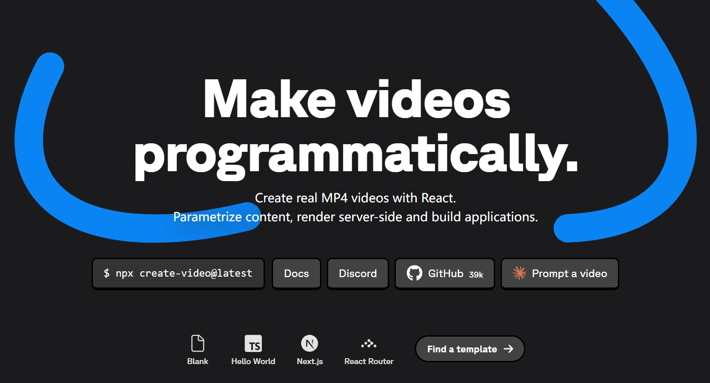

> 你有没有想过，一段用 React 写的动画代码，是怎么变成一个 MP4 文件的？答案可能比你想象的更"暴力"，也更精妙。

---

## 开篇：一个"荒诞"的想法

2021 年初，一个叫 Jonny Burger 的瑞士开发者发布了 Remotion——一个用 React 写视频的框架。

乍一听，这个想法有点荒诞。视频编辑不是有 Premiere、After Effects 这些专业工具吗？为什么要用写网页的方式来做视频？

但如果你是一个开发者，你就会明白这种吸引力：**代码才是最强大的创作工具**。你可以用循环生成一千个不同标题的视频，可以接 API 动态填充数据，可以把 Three.js 的 3D 场景直接渲染成高清视频——这些都是传统视频工具做不到的。

Remotion 如今已在 GitHub 斩获 **21,000+ Star**，被用于自动生成 GitHub Wrapped、代码解说视频、数据可视化短片等各类场景。

但它的核心技术原理，许多使用者其实并不清楚。今天我们就来彻底拆解它：**Remotion 到底是怎么把 React 组件变成 MP4 的？**

---

## 一、社区流传的说法：准确吗？

社区里最常见的解释是：

> "Remotion 用无头浏览器截图，然后把截图拼成视频，再加上音频合成。"

这个说法对吗？**大体正确，但远远不够精确。**

准确的技术表述应该是：

**Webpack 打包 React 应用 → Chrome Headless Shell 通过 CDP 协议逐帧注入帧号并执行 `Page.captureScreenshot` → 帧数据通过 stdin 管道流式传输给预启动的 FFmpeg 进程实时编码 → FFmpeg `filter_complex` 混合多条音频轨道 → 输出 MP4。**

这中间遗漏了几个关键工程细节：

- 不是 Puppeteer，而是内联的 CDP 实现
- 不是"截完再合"，而是流水线并行
- 有精密的"渲染就绪"同步机制
- 每帧是幂等的——这一点是整个架构的灵魂

接下来我们一层层剥开。

---

## 二、五阶段渲染流水线

整个渲染过程分为五个清晰的阶段。理解了这五个阶段，你就理解了 Remotion 的全部。

### 阶段一：打包（Bundle）

Remotion 首先把你的 React 项目用 Webpack（可选 Rspack）打包成一个**自包含的静态网站**。

这里有个容易忽视的细节：入口文件并不是你自己的代码，而是 `@remotion/studio/renderEntry.mjs`——Remotion 的渲染运行时。你的组件被作为动态依赖注入进来。

打包结果就是一个普通的 Web 应用：`index.html` + 编译后的 JS bundle + `public/` 静态资源。任何 HTTP 服务器都能托管它，这为后续的云端渲染奠定了基础。

打包时 Remotion 会做一个验证：确认入口文件里有 `registerRoot()` 调用。这是你告诉 Remotion "我的 Composition 在这里"的方式。

### 阶段二：解析 Composition 元数据

打包完成后，`selectComposition()` 在无头浏览器里打开这个 bundle，从 React 组件树中提取 Composition 的"档案"：

```typescript
{
  id: 'MyVideo',
  width: 1920,
  height: 1080,
  fps: 30,
  durationInFrames: 300  // 10 秒 × 30fps
}
```

这些信息是你在 `<Composition>` 组件里声明式定义的。Remotion 拿到这些参数后，才知道要渲染多少帧、每帧多大。

### 阶段三：逐帧截图（核心）

这是最关键的阶段，也是 Remotion 真正的灵魂所在。

核心代码在 `packages/renderer/src/render-frames.ts`，大约 800 行，处理并发帧渲染的全部逻辑。

**对每一帧，渲染器执行三步操作：**

**第一步：设置帧号。** 通过 CDP 协议在浏览器里执行 `window.remotion_setFrame(N)`，触发 React Context 更新，所有 `useCurrentFrame()` 调用返回新帧号，整棵组件树重新渲染。

**第二步：等待渲染就绪。** 这里有个精妙的同步机制。`requestAnimationFrame` 回调会将 `window.remotion_renderReady` 设为 `true`，渲染器通过轮询这个标志确认浏览器真正完成了绘制。如果你在代码里调用了 `delayRender()`（比如等待字体加载、网络请求），`remotion_renderReady` 会保持为 `false`，直到你调用 `continueRender()` 才允许截图。默认超时 30 秒。

**第三步：截图。** 确认就绪后，调用 CDP 的 `Page.captureScreenshot`，抓取当前页面画面。截图格式默认是 **JPEG**（质量 80，最快），也支持 PNG（无损，适合透明视频）。

与此同时，`collectAssets()` 并行执行，收集该帧引用的所有音频/视频资源信息，供后续音频混合使用。

### 阶段四：FFmpeg 编码

截图不是先全部存到磁盘再合成的。Remotion 使用了流水线并行：

`prespawnFfmpeg()` 在帧渲染**开始之前**就预启动 FFmpeg 子进程，配置为 `image2pipe` 格式输入。每帧截图完成后，直接通过 **stdin 管道**写入 FFmpeg，FFmpeg 实时编码，整个过程在内存中流转，避免了大量磁盘 I/O。

音频处理同样由 FFmpeg 完成，但逻辑更复杂。`createAudio()` 会构建一张 FFmpeg `filter_complex` 混音图：

```
[0:a]atrim=start=1.5:end=5.0,adelay=2000|2000,volume=0.8[a0];
[1:a]atrim=start=0:end=3.0,adelay=0|0,volume=1.0[a1];
[a0][a1]amix=inputs=2[out]
```

每条音频轨道经过裁剪（`atrim`）、延迟（`adelay`）、音量调节（`volume`）处理后，通过 `amix` 合并。这套机制支持 Remotion 里 `<Audio>` 和 `<Video>` 组件的完整音频语义。

### 阶段五：输出

音视频流 mux 为目标格式（MP4、WebM、MOV、MKV、GIF 等），清理临时文件，关闭浏览器。

`renderMedia()` 是整合阶段三到五的一站式高级 API：

```typescript
await renderMedia({
  composition,
  serveUrl: bundleLocation,
  codec: 'h264',
  outputLocation: 'out/video.mp4',
});
```

---

## 三、最关键的设计决策：帧的幂等性

理解了渲染流水线，我们来讨论 Remotion 最重要的设计决策，也是整个架构的灵魂：**每一帧的渲染是幂等的。**

幂等，意味着：给定相同的帧号，无论渲染多少次，一定产生完全相同的输出。帧与帧之间没有任何状态依赖。

这不是偶然的，而是 Jonny Burger 刻意为之的架构约束。在 React Summit 2021 的演讲中，他明确说：

> "It pretty much only works if I give you a frame, you must return a static image that does not have any side effects."

**为什么这个约束如此重要？**

因为它使得以下所有事情成为可能：

**任意顺序渲染**：第 100 帧不需要等第 99 帧渲染完，可以直接从帧号 100 开始。

**多核并行**：本地渲染时，Remotion 默认开启"CPU 线程数 ÷ 2"个并发 Page（浏览器标签页），它们同时渲染不同帧，互不干扰。

**分布式云渲染**：最多可以把视频切成 200 个 chunk，分发给 200 个 Lambda 函数并行渲染，最后合并。这就是 Remotion Lambda 的实现基础。

**精确重渲**：渲染失败时，只需重新渲染失败的那几帧，而不是从头开始。

作为开发者，你需要在写 Remotion 组件时遵守这个约束——**不能使用 `Math.random()`，不能在渲染时写入外部状态，不能依赖实时时钟**（`Date.now()` 在每次渲染同一帧时可能返回不同值）。

这就是为什么 `useCurrentFrame()` 是 Remotion 最核心的 API——时间的唯一来源就是帧号，计算公式极简：

```typescript
const time = frame / fps;  // 当前帧对应的时间（秒）
```

---

## 四、Chrome Headless Shell：不是 Puppeteer

许多人以为 Remotion 用的是 Puppeteer。其实从 v3 开始，Remotion 已经**内联**（inline）了 Puppeteer 核心的 CDP 通信代码，直接与 Chrome DevTools Protocol 交互，不再依赖 Puppeteer npm 包。

更关键的是，Remotion 使用的不是普通的 Chrome，而是 **Chrome Headless Shell**——一个从 Chrome 提取的精简无界面二进制，专门为截图和自动化场景优化，体积更小，启动更快。

启动时，Remotion 会传入大量精心调配的 Chromium 标志：

```typescript
'--disable-features=AudioServiceOutOfProcess',
'--font-render-hinting=none',   // 禁用字体微调，确保跨平台一致性
'--no-zygote',                  // 禁用进程预热，节省资源
'--ignore-gpu-blocklist',       // 强制启用 GPU 渲染
'--enable-unsafe-webgpu',       // 支持 WebGPU
'--remote-debugging-port=0',    // CDP 通信端口（动态分配）
```

其中 `--font-render-hinting=none` 值得特别关注。字体微调（hinting）在不同操作系统上的行为不同，关闭它才能确保 macOS 上开发的视频在 Linux 服务器上渲染出完全相同的效果。

`chromeMode` 支持两种模式：默认的 `headless-shell`（无 GPU，适合服务器）和 `chrome-for-testing`（支持 GPU 加速，需要虚拟显示层，适合 WebGL/WebGPU 内容）。

---

## 五、Remotion Lambda：把视频渲染"炸"到云上

本地渲染一段 5 分钟 30fps 的 1080p 视频，需要渲染 9000 帧，单线程需要十几分钟。Remotion Lambda 通过 AWS Lambda 的极致并发，把这个时间压缩到**十几秒**。

官方性能数据：**80 秒视频约 15 秒渲染完成，2 小时视频约 12 分钟**。

Lambda 渲染架构如下：

```
客户端
  │
  ▼
renderMediaOnLambda()
  │
  ▼
主 Lambda（Orchestrator）
  ├── 加载 Serve URL（S3 上的 bundle）
  ├── 解析 Composition 元数据
  ├── 按 framesPerLambda 计算分块（默认 20 帧/块）
  │
  └── 并行调用最多 200 个 Renderer Lambda
        ├── Lambda #1：渲染第 0-19 帧   → 输出 chunk-0.mp4
        ├── Lambda #2：渲染第 20-39 帧  → 输出 chunk-1.mp4
        ├── Lambda #3：渲染第 40-59 帧  → 输出 chunk-2.mp4
        └── ...（最多 200 个）
              │
              ▼（Response Streaming，二进制流式传回）
主 Lambda
  ├── 无缝拼接所有 chunk（处理 AAC 帧边界对齐）
  └── 上传最终 MP4 到 S3
```

这里有一个工程难点：**音频 chunk 拼接**。H.264 视频的 chunk 拼接相对简单（使用 MPEG-TS 容器），但 AAC 音频有固定帧大小（1024 个样本），如果 chunk 边界不对齐 AAC 帧，拼接处会出现音频间断。

Remotion v4.0.123 引入了 `forSeamlessAacConcatenation` 参数，在分块时会自动将切割点对齐到最近的 AAC 帧边界，解决了这个问题。

---

## 六、`delayRender`：异步内容的优雅解法

视频里经常需要加载字体、从 API 获取数据、等待图片解码。如何确保这些异步操作完成后才截图？

Remotion 的解法是 `delayRender` / `continueRender` API：

```typescript
import { delayRender, continueRender } from 'remotion';

const MyComp = () => {
  const [data, setData] = useState(null);
  const handle = useRef(delayRender()); // 通知渲染器：还没准备好

  useEffect(() => {
    fetch('https://api.example.com/data')
      .then(r => r.json())
      .then(d => {
        setData(d);
        continueRender(handle.current); // 通知渲染器：可以截图了
      });
  }, []);

  if (!data) return null;
  return <div>{data.title}</div>;
};
```

内部实现原理：`delayRender()` 将 `window.remotion_renderReady` 设为 `false`；`continueRender()` 将其恢复为 `true`。渲染器使用 `requestAnimationFrame` 轮询这个标志，只有为 `true` 时才调用 `Page.captureScreenshot`。

这个机制的精妙之处在于：它对每一帧独立生效。第 0 帧可能需要等待数据加载，第 1 帧则可以直接截图，两者互不影响。

---

## 七、客户端渲染：新前沿

传统的服务端渲染（Chrome Headless + FFmpeg）是 Remotion 的主力方案，但它有个明显局限：需要服务器，需要 Node.js 环境，用户浏览器里无法直接渲染。

Remotion 正在推进**客户端渲染**路径，完全在浏览器里运行：

```
Canvas 2D API / OffscreenCanvas
         ↓（逐帧绘制）
WebCodecs API（VideoEncoder）
         ↓（硬件加速编码）
MP4/WebM 文件（直接下载）
```

`@remotion/webcodecs` 和 `@remotion/web-renderer` 是这个新方向的两个实验性包。WebCodecs API 可以调用设备的硬件编码器（H.264、VP9、AV1），编码性能远超 FFmpeg 软编。

局限在于：当前客户端渲染只支持有限的 HTML/CSS 子集，复杂的 DOM 结构、CSS 动画、Web 字体等仍然需要走传统的 Chromium 路径。但这个方向的潜力巨大——想象一下，用户在浏览器里就能把视频编辑结果直接导出为 MP4，无需任何服务器。

---

## 八、架构全景图

把上面所有内容综合起来，Remotion 的完整技术架构如下：

```
你写的 React 代码
        │
        ▼
  @remotion/bundler
  (Webpack/Rspack 打包)
        │
        ▼
  静态 Web App (bundle)
        │
        ├─────────────────────────────────┐
        ▼                                 ▼
本地渲染路径                          Lambda 分布式渲染
        │                                 │
  Chrome Headless Shell           最多 200 个 Lambda
  (CDP 协议)                      并行运行 Chrome
        │                                 │
  逐帧 captureScreenshot          分块渲染 + 流式传回
        │                                 │
  stdin 管道 → FFmpeg                     │
  (h264/vp8/prores/gif)          主 Lambda 无缝拼接
        │                                 │
        └─────────────────────────────────┘
                        │
                        ▼
                   最终视频文件
                (MP4/WebM/MOV/GIF)

（未来方向）
        │
        ▼
  @remotion/webcodecs
  客户端 Canvas + WebCodecs
  浏览器直出 MP4（实验性）
```

---

## 九、实际启示：你能从中学到什么？

Remotion 的架构给了我们几个值得借鉴的工程思想：

**1. 幂等性是扩展性的基础。** 把"渲染第 N 帧"设计成无副作用的纯函数，是 Remotion 能做并行渲染、分布式渲染、失败重试的根本原因。这个思想可以迁移到任何需要大规模并行的计算任务。

**2. 流水线并行比"先做完再做"更高效。** FFmpeg 预启动、帧通过管道流入，实现了渲染和编码的重叠执行，这是经典的生产者-消费者模型在实际工程中的漂亮应用。

**3. 用浏览器作为渲染引擎是一个被低估的选择。** CSS、WebGL、Canvas、SVG、Web 字体——浏览器是地球上最强大的图形渲染引擎之一，且有全球最大的开发者生态。Remotion 的本质，是把浏览器的渲染能力转化为批量生产视频帧的能力。

**4. 约束创造可能。** `useCurrentFrame()` 只能读帧号，不能写状态——这个约束看起来是限制，实际上是解放。正是这个约束，使得视频的每一帧都可以在任意时间、任意地点、任意顺序被渲染。

---

## 尾声：它不是摄像机，但更强大

标题借用了 Replit 工程博客的一句话："浏览器不想成为摄像机"。录屏软件是让浏览器假装自己是摄像机，实时捕捉它播放的内容；而 Remotion 走了完全不同的路——**把浏览器变成一台可以无限暂停、倒带、跳跃的精密照相机，一帧一帧地拍下完美的画面。**

没有丢帧。没有时钟漂移。每一帧都精确对应你代码里的逻辑。

这才是 Remotion 真正厉害的地方。

---

*参考资料：*
- *Remotion 官方文档：remotion.dev/docs*
- *Remotion GitHub 仓库：github.com/remotion-dev/remotion*
- *Jonny Burger @ React Summit 2021：Creating Videos Programmatically in React*
- *Syntax Podcast #550：Supper Club × Remotion React Video with Jonny Burger*
- *Replit Engineering Blog：We Built a Video Rendering Engine by Lying to the Browser About What Time It Is*